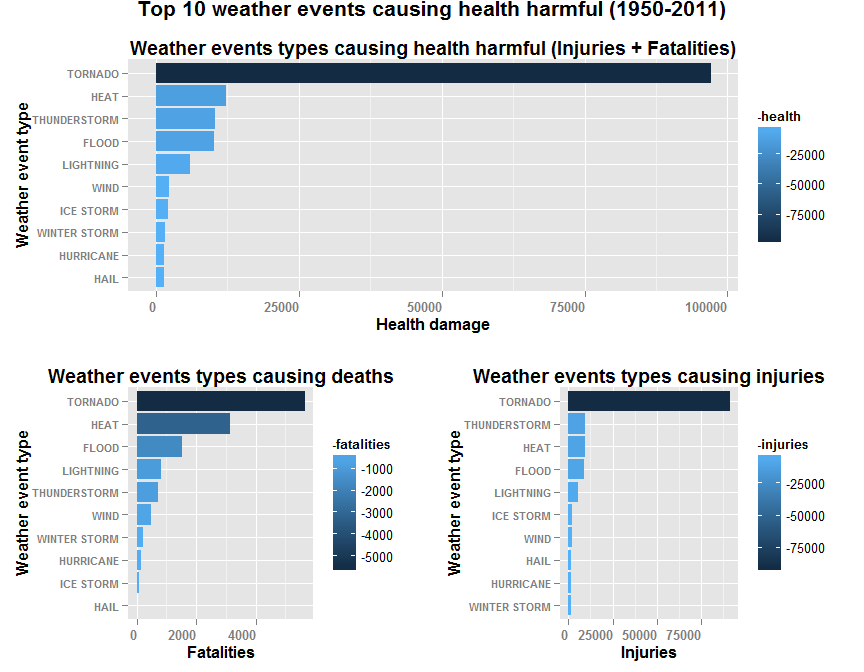
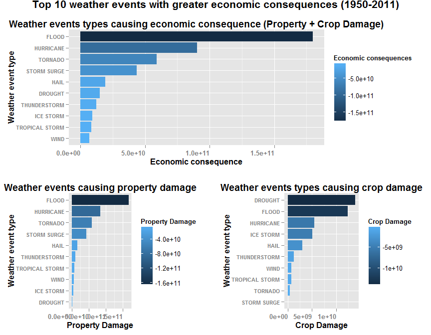

# Analysis about weather events can cause both public health and economic problems
Diego Gaona  
Saturday, May 23, 2015  
##Synopsis
This project involves exploring the U.S. National Oceanic and Atmospheric Administration's (NOAA) storm database (1950-2011). This database tracks characteristics of major storms and weather events in the United States, including when and where they occur, as well as estimates of any fatalities, injuries, and property damage.
The events in the database start in the year 1950 and end in November 2011. In the earlier years of the database there are generally fewer events recorded, most likely due to a lack of good records. More recent years should be considered more complete.
The basic goal of this analysis is to explore the NOAA Storm Database and answer some basic questions about severe weather events:
Across the United States, which types of events are most harmful with respect to population health? (injuries and fatalities)
Across the United States, which types of events have the greatest economic consequences? (property damage and crop damage)

##Data Processing
I'm using R Version 3.1.3 with RStudio Version 0.98.1103.
First I load the necessary packages for my analysis, and then download and read the FStormData.csv.bz2 data with read.csv.
Because i'm in another country, i set the time and language to english.

```r
## Load the packages
library(knitr)
opts_chunk$set(echo = T, cache = TRUE, fig.width=9, fig.height=7)
knitr::opts_chunk$set(tidy=FALSE, fig.path='figures/')
require("dplyr")
require("tidyr")
require("ggplot2")
require("reshape2")
library("gridExtra")
## Set to english language and time
Sys.setlocale("LC_TIME", "English")
## Download and read the data
fileURL <- "http://d396qusza40orc.cloudfront.net/repdata%2Fdata%2FStormData.csv.bz2"
if (!file.exists("./datafile.csv.bz2")) {
    download.file(fileUrl, destfile = "./datafile.csv.bz2")
}
zipdatafile <- "./datafile.csv.bz2" ## create zipdata file

rawdata <- read.csv(zipdatafile, header = TRUE, stringsAsFactors = FALSE)
```
Now i visualize the first 10 rows of data to explore the raw data

```r
head(rawdata)
```

```
##   STATE__           BGN_DATE BGN_TIME TIME_ZONE COUNTY COUNTYNAME STATE
## 1       1  4/18/1950 0:00:00     0130       CST     97     MOBILE    AL
## 2       1  4/18/1950 0:00:00     0145       CST      3    BALDWIN    AL
## 3       1  2/20/1951 0:00:00     1600       CST     57    FAYETTE    AL
## 4       1   6/8/1951 0:00:00     0900       CST     89    MADISON    AL
## 5       1 11/15/1951 0:00:00     1500       CST     43    CULLMAN    AL
## 6       1 11/15/1951 0:00:00     2000       CST     77 LAUDERDALE    AL
##    EVTYPE BGN_RANGE BGN_AZI BGN_LOCATI END_DATE END_TIME COUNTY_END
## 1 TORNADO         0                                               0
## 2 TORNADO         0                                               0
## 3 TORNADO         0                                               0
## 4 TORNADO         0                                               0
## 5 TORNADO         0                                               0
## 6 TORNADO         0                                               0
##   COUNTYENDN END_RANGE END_AZI END_LOCATI LENGTH WIDTH F MAG FATALITIES
## 1         NA         0                      14.0   100 3   0          0
## 2         NA         0                       2.0   150 2   0          0
## 3         NA         0                       0.1   123 2   0          0
## 4         NA         0                       0.0   100 2   0          0
## 5         NA         0                       0.0   150 2   0          0
## 6         NA         0                       1.5   177 2   0          0
##   INJURIES PROPDMG PROPDMGEXP CROPDMG CROPDMGEXP WFO STATEOFFIC ZONENAMES
## 1       15    25.0          K       0                                    
## 2        0     2.5          K       0                                    
## 3        2    25.0          K       0                                    
## 4        2     2.5          K       0                                    
## 5        2     2.5          K       0                                    
## 6        6     2.5          K       0                                    
##   LATITUDE LONGITUDE LATITUDE_E LONGITUDE_ REMARKS REFNUM
## 1     3040      8812       3051       8806              1
## 2     3042      8755          0          0              2
## 3     3340      8742          0          0              3
## 4     3458      8626          0          0              4
## 5     3412      8642          0          0              5
## 6     3450      8748          0          0              6
```
After i see the rawdata, i know the data have many columns I don't need for my analysis.
Now i load the data that will be more interesting in this analysis (some for a future analysis), and i transform the exponencial data from PROPDMGEXP and PROPDMGEXP into numeric.

```r
data <- rawdata[c(2,7,8,23,24,25,26,27,28,37)]
## Replace the exponencials letters by numbers in the columns "PROPDMGEXP" and "CROPDMGEXP"
## Replace the letters by numbers
data$PROPDMGEXP = gsub("\\-|\\+|\\?|h|H|0","0",data$PROPDMGEXP)
data$PROPDMGEXP = gsub("k|K", "1000", data$PROPDMGEXP)
data$PROPDMGEXP = gsub("m|M", "1000000", data$PROPDMGEXP)
data$PROPDMGEXP = gsub("b|B", "1000000000", data$PROPDMGEXP)
data$PROPDMGEXP <- as.numeric(data$PROPDMGEXP)
data$PROPDMGEXP[is.na(data$PROPDMGEXP)] = 0
data$CROPDMGEXP <- as.character(data$CROPDMGEXP)
data$CROPDMGEXP = gsub("\\-|\\+|\\?|h|H|0","0",data$CROPDMGEXP)
data$CROPDMGEXP = gsub("k|K", "1000", data$CROPDMGEXP)
data$CROPDMGEXP = gsub("m|M", "1000000", data$CROPDMGEXP)
data$CROPDMGEXP = gsub("b|B", "1000000000", data$CROPDMGEXP)
data$CROPDMGEXP <- as.numeric(data$CROPDMGEXP)
data$CROPDMGEXP[is.na(data$CROPDMGEXP)] = 0
```
Now I start to refine the data, got the damages multiplicated by their exponencials, renemo the columns to more tidy names, transform the date column in date format (i will not use in this analysis, but I want to leave the data in the right way for the future)

```r
## Multiply the damages values by the exponents
data <- mutate(data, PROPDMG = PROPDMGEXP * PROPDMG) 
data <- mutate(data, CROPDMG = CROPDMGEXP * CROPDMG) 
## Rename the columns
colnames(data) <- c("begin_date","state","event_type","fatalities","injuries",
                    "property_damage","property_damage_exp","crop_damage","crop_damage_exp","reference_number")
## Transform the date variables in Posix format
data$begin_date <- as.Date(strptime(data$begin_date, format = "%m/%d/%Y %H:%M:%S"))  
data$begin_date <- as.factor(format(data$begin_date,format="%Y")) ## I will use only the year
```
Now I subset my data to the data i need to this analysis. I will remove some columns, convert all the "event_types" column to uppercase and get only the rows with fatalities, injuries, property or crop damage.

```r
subdata <- data[c(1,3,4,5,6,8)]
## Convert all the event_types to factor and uppercase to reduce the mistyped errors
subdata$event_type <- factor(toupper(as.character(subdata$event_type)))
# Now i subset for only the data with fatalities, injuries, property or crop damage.
subdata <- subset(subdata, fatalities > 0 | injuries > 0 | property_damage > 0 | crop_damage > 0,
                  select=begin_date:crop_damage)
```
To explore the current subdata, i used  to view my unique event types. After that (and by reading the documentantion in NOAA website) i have a idea about what event types i need to rename to improve the results and reduce the missleads.

```r
## Replaces: Ex. Replace all that contains "FLOOD" (FLASH FLOOD and others) by exactly "FLOOD" 
## The order is important, because the replacement is sequencial. Example, some events have: 
## "WIND" and "THUNDERSTORM", i prioritized "THUNDERSTORM" before wind.
subdata$event_type[grepl("TORNADO", subdata$event_type)] <- "TORNADO"
subdata$event_type[grepl("HURRICANE", subdata$event_type)] <- "HURRICANE"
subdata$event_type[grepl("FLOOD", subdata$event_type)] <- "FLOOD"
subdata$event_type[grepl("BLIZZARD", subdata$event_type)] <- "BLIZZARD"
subdata$event_type[grepl("DROUGHT", subdata$event_type)] <- "DROUGHT"
subdata$event_type[grepl("HEAT", subdata$event_type)] <- "HEAT"
subdata$event_type[grepl("AVALANC", subdata$event_type)] <- "AVALANCHE"
subdata$event_type[grepl("COLD", subdata$event_type)] <- "COLD"
subdata$event_type[grepl("THUN.*.ORM|TSTM|THUN.*.TROM", subdata$event_type)] <- "THUNDERSTORM"
subdata$event_type[grepl("TROPICAL STORM", subdata$event_type)] <- "TROPICAL STORM"
subdata$event_type[grepl("SNOW", subdata$event_type)] <- "SNOW"
subdata$event_type[grepl("WIND", subdata$event_type)] <- "WIND"
subdata$event_type[grepl("HAIL", subdata$event_type)] <- "HAIL"
subdata$event_type[grepl("LIGHTNING", subdata$event_type)] <- "LIGHTNING"
subdata$event_type[grepl("RAIN", subdata$event_type)] <- "RAIN"
subdata$event_type[grepl("FROST|FREEZE", subdata$event_type)] <- "FROST/FREEZE"
subdata$event_type = gsub("WILDFIRE|WILDFIRES|WILD///FOREST FIRE|WILD FIRES", "FIRE", subdata$event_type)
```
Now i create a column with the sums of the health damages (injuries + fatalities) and another with the sums of damages (property damage + crop damage) and order by the mostly harmful and more economic dangerous.

```r
## Create a column with the sum of fatalities and injuries
summhealth <- mutate(subdata, health = fatalities + injuries)
## Subset the data to show only the events harmful to health and summarize the data by event type.
summhealth <- aggregate(cbind(fatalities, injuries, health) ~ event_type, summhealth[which(summhealth$health != 0),], sum, na.action = na.pass)
## Arrange to descend by the more harmful events
summhealth <- arrange(summhealth, desc(health))
## Do the same about the economic damages
summeconon <- mutate(subdata, economic = property_damage + crop_damage)
summeconon <- aggregate(cbind(property_damage, crop_damage, economic) ~ event_type, summeconon[which(summeconon$economic != 0),], sum, na.action = na.pass)
summeconon <- arrange(summeconon, desc(economic))
```
## Results
My results are show in the plots bellow, that first plot shows the top 10 greater health harmful weather events between 1950-2011.

```r
p1 <- ggplot(summhealth[c(1:10), c(1:4)], aes(x=reorder(event_type, health), y = health, fill = -health)) + 
      geom_bar(stat = "identity") +
      #scale_fill_gradient("Health damage") +
      xlab("Weather event type") + ylab("Health damage") +
      ggtitle ("Weather events types causing health harmful (Injuries + Fatalities)") +
      theme(axis.text.x = element_text(hjust = 1, face="bold")) +
      theme(axis.text.y = element_text(hjust = 1, face="bold", size = 8)) +
      theme(plot.title = element_text(lineheight=.8, face="bold")) +
      theme(axis.title.x = element_text(lineheight=.8, face="bold")) +
      theme(axis.title.y = element_text(lineheight=.8, face="bold")) +
      coord_flip()
p2 <- ggplot(summhealth[c(1:10), c(1:4)], aes(x=reorder(event_type, fatalities), y = fatalities, fill = -fatalities)) + 
      geom_bar(stat = "identity") +
      #scale_fill_gradient("Fatalities") +
      xlab("Weather event type") + ylab("Fatalities") +
      ggtitle ("Weather events types causing deaths") +
      theme(axis.text.x = element_text(hjust = 1, face="bold")) +
      theme(axis.text.y = element_text(hjust = 1, face="bold", size = 8)) +
      theme(plot.title = element_text(lineheight=.8, face="bold")) +
      theme(axis.title.x = element_text(lineheight=.8, face="bold")) +
      theme(axis.title.y = element_text(lineheight=.8, face="bold")) +
      coord_flip()
p3 <- ggplot(summhealth[c(1:10), c(1:4)], aes(x=reorder(event_type, injuries), y = injuries, fill = -injuries)) + 
      geom_bar(stat = "identity") +
      #scale_fill_gradient("Injuries") +
      xlab("Weather event type") + ylab("Injuries") +
      ggtitle ("Weather events types causing injuries") +
      theme(axis.text.x = element_text(hjust = 1, face="bold")) +
      theme(axis.text.y = element_text(hjust = 1, face="bold", size = 8)) +
      theme(plot.title = element_text(lineheight=.8, face="bold")) +
      theme(axis.title.x = element_text(lineheight=.8, face="bold")) +
      theme(axis.title.y = element_text(lineheight=.8, face="bold")) +
      coord_flip()
grid.arrange(arrangeGrob(p1, nrow=1),
             arrangeGrob(p2,p3,nrow=1), 
             nrow = 2, main=textGrob("Top 10 weather events causing health harmful (1950-2011)",gp=gpar(fontsize=16, fontface = "bold")))
```

 

My results are show in the plots bellow, that second plot shows the top 10 greater economic dangerous  weather events.

```r
g1 <- ggplot(summeconon[c(1:10), c(1:4)], aes(x=reorder(event_type, economic), y = economic, fill = -economic)) + 
      geom_bar(stat = "identity") +
      scale_fill_gradient("Economic consequences") +
      xlab("Weather event type") + ylab("Economic consequence") +
      ggtitle ("Weather events types causing economic consequence (Property + Crop Damage)") +
      theme(axis.text.x = element_text(hjust = 1, face="bold")) +
      theme(axis.text.y = element_text(hjust = 1, face="bold", size = 8)) +
      theme(plot.title = element_text(lineheight=.8, face="bold")) +
      theme(axis.title.x = element_text(lineheight=.8, face="bold")) +
      theme(axis.title.y = element_text(lineheight=.8, face="bold"))  +
      coord_flip()           
g2 <- ggplot(summeconon[c(1:10), c(1:4)], aes(x=reorder(event_type, property_damage), y = property_damage, fill = -property_damage)) + 
      geom_bar(stat = "identity") +
      scale_fill_gradient("Property Damage") +
      xlab("Weather event type") + ylab("Property Damage") +
      ggtitle ("Weather events causing property damage") +
      theme(axis.text.x = element_text(hjust = 1, face="bold")) +
      theme(axis.text.y = element_text(hjust = 1, face="bold", size = 8)) +
      theme(plot.title = element_text(lineheight=.8, face="bold")) +
      theme(axis.title.x = element_text(lineheight=.8, face="bold")) +
      theme(axis.title.y = element_text(lineheight=.8, face="bold")) +
      coord_flip()
g3 <- ggplot(summeconon[c(1:10), c(1:4)], aes(x=reorder(event_type, crop_damage), y = crop_damage, fill = -crop_damage)) + 
      geom_bar(stat = "identity") +
      scale_fill_gradient("Crop Damage") +
      xlab("Weather event type") + ylab("Crop Damage") +
      ggtitle ("Weather events types causing crop damage") +
      theme(axis.text.x = element_text(hjust = 1, face="bold")) +
      theme(axis.text.y = element_text(hjust = 1, face="bold", size = 8)) +
      theme(plot.title = element_text(lineheight=.8, face="bold")) +
      theme(axis.title.x = element_text(lineheight=.8, face="bold")) +
      theme(axis.title.y = element_text(lineheight=.8, face="bold")) +
      coord_flip()
grid.arrange(arrangeGrob(g1, nrow=1),
             arrangeGrob(g2,g3,nrow=1), 
             nrow = 2, main=textGrob("Top 10 weather events with greater economic consequences (1950-2011)",gp= gpar(fontsize=16, fontface = "bold")))
```

 

## Conclusion
The **Tornados** are the mostly dangerous events for human health with many fatalities and injuries, but in the economic aspect, the **flood** have more impact, more in property damage than in crop damage. Drought cause more economic consequences to crop, but little to property.
